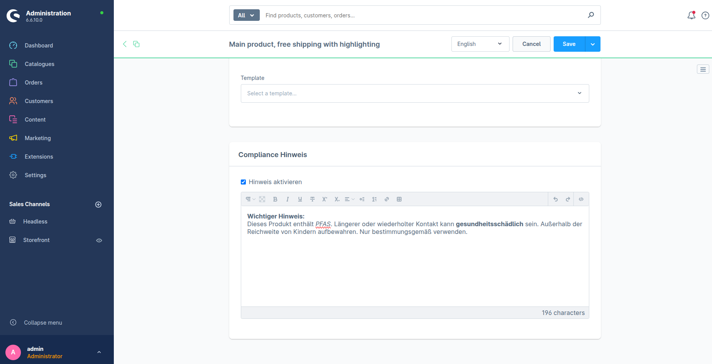
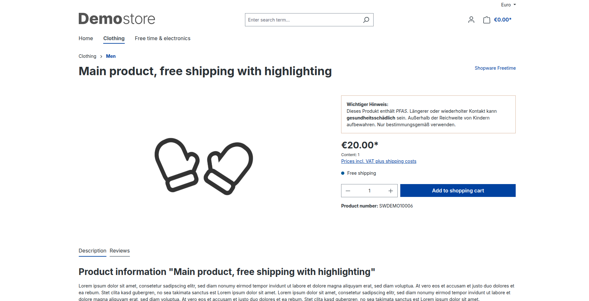

# ArnowaComplianceHint
Ermöglicht das Pflegen von Compliance-Hinweisen für Produkte im Admin:


Hinweis wird dann auf Produktdetailseite angezeigt:


## Installation

1. Plugin-Ordner `ArnowaComplianceHint` nach `custom/plugins/` kopieren
2. a) Entweder: Plugin über console installieren und aktivieren:

```bash
bin/console plugin:refresh
bin/console plugin:install --activate ArnowaComplianceHint
bin/console cache:clear
```
2. b) Oder: Shopware Admin öffnen und unter "Extensions"->"My extensions"->"Product Compliance Hint" suchen und über das "..." installieren->wenn noch nicht aktiv, links über Checkbox aktivieren

---

## Funktionsumfang

**Administration:**
- Checkbox „Besonderer Hinweis erforderlich" im Reiter „Spezifikationen" der Produktseiten ("Kataloge"->"Produkte"->Produkt XY auswählen->Reiter "Spezifikationen" ganz nach unten scrollen)
- HTML-Editor für den Hinweistext (nur aktiv wenn Checkbox gesetzt)

**Storefront:**
- Anzeige des Hinweises auf der Produktdetailseite oberhalb des Kauf-Buttons
- Warum über dem Buy-Button: Kunde sieht den Hinweis automatisch, weil Preis und Buy-Button essenziell für Checkout sind
- Anzeige nur wenn Checkbox aktiv und Hinweistext gepflegt
- HTML wird gerendert, ermöglicht flexible Gestaltung durch Produktmanager/Anwender

---

## Technische Anforderungen

### Entity Extension oder Custom Fields

**Custom Fields** speichern Daten als JSON-Blob in der `custom_fields`-Spalte der `product`-Tabelle. Sobald eine Conditional Logic benötigt wird (Textarea nur editierbar wenn Checkbox aktiv), muss trotzdem eine eigene Vue-Komponente geschrieben werden. Eine "simplere" Lösung mit Custom Field wäre allerdings auch möglich gewesen. Man könnte das gefüllte, bzw. nicht gefüllte Custom Field auch als Kondition betrachten (wenn Inhalt nicht leer -> zeige Hinweis auf PDS an). Das einfache an- und ausschalten über die Checkbox würde jedoch entfallen und Hinweise müssten irgendwie zwischengespeichert werden (in dem Fall, dass man einen Hinweis nur temporär ausblenden wollen würde).

**Entity Extension** eine eigene Datenbanktabelle (`arnowa_compliance_hint`) bietet dagegen ein klar definiertes, typisiertes Schema, volle Kontrolle über die Admin-Komponente und eine skalierbare Basis für zukünftige Erweiterungen. Des Weiteren ist die Implementierung der klar angeforderten Checkbox-Funktion überhaupt erst möglich. Um die Anforderungen also vollständig zu erfüllen, war die Entity Extension die einzig mögliche Option. 

### Subscriber statt Logik im Twig

Die Compliance-Daten werden über zwei Shopware-Events bereitgestellt:

- `ProductPageCriteriaEvent` – lädt die Association `arnowaComplianceHint` direkt mit dem Produkt, ohne extra Datenbankabfrage
- `ProductPageLoadedEvent` – prüft ob Checkbox aktiv und Text vorhanden ist. Hinweis Daten für die PDS werden als Extension bereitgestellt, welche dann weiter im Twig...

...als `page.extensions.arnowaComplianceHint` in einer if-Anweisung benutzt werden können. Das Twig-Template kümmert sich dann ausschließlich um die Anzeige des Hinweises. Außerdem erweitert das Twig das Shopware-Standard buy-box template auf eine sehr simple Art und Weise, ohne dabei die Standard-Funktion zu behindern. 

---

## Konzeptfragen

### 1. Hinweis nur für bestimmte Kundengruppen (z. B. B2B) sichtbar

Der Subscriber hat bereits Zugriff auf den `SalesChannelContext`, der die aktuelle Kundengruppe enthält. Man würde die `ComplianceHintEntity` und damit zwangsweise die SQL-Tabelle (`arnowa_compliance_hint`) um ein Feld bspw. `customer_group_ids` erweitern, in dem hinterlegt wird für welche Kundengruppen der Hinweis gilt. In der `onProductLoaded` Methode des Subscribers wird dann geprüft ob die Kundengruppe des aktuellen Nutzers in dieser Liste enthalten ist – nur dann wird der Hint als Page-Extension gesetzt. Im Admin müsste man dann noch die Vue-Komponente um eine Mehrfachauswahl der Kundengruppen erweitern, sodass bestimmte Kundengruppen ein- bzw. ausgeschlossen werden können.

### 2. Rechtliche Hinweise versioniert und historisch nachvollziehbar

Ich würde eine separate Tabelle `arnowa_compliance_hint_history` anlegen, die bei jedem Speichern eines Hinweises automatisch einen neuen Eintrag mit Timestamp, User-ID und dem kompletten Hinweistext erstellt. Das Ganze in Verbindung mit einem weiteren Subscriber, welcher auf das Event der/des Erstellung/Updates eines Hinweises hört. 

### 3. Warum keine Geschäftslogik im Twig-Template

Twig-Templates sind für die Darstellung zuständig, nicht für Business-Logik. Twig-Templates lassen sich dennoch um nützliche Funktionen und Filter erweitern. Die Anforderungen, welche in dem Aufgaben-PDF dokumentiert wurden, sind allerdings zu komplex für simple Twig-Funktionen. Außerdem ist eine deutliche Trennung von Presentation-Layer (Twig), Business-Layer(PHP) und Data-Layer (MySQL) immer sinnvoll.

### 4. Kriterien für die Entscheidung Custom Field vs. Entity Extension


Custom-Fields:
- Ideal für simple und schnelle Lösungen
- Aus den Anforderungen ergeben sich keine Relationen zu anderen Entitäten 
- Nützlich für 1:1 oder 1:n Beziehungen mit Custom-Entitäten über Fremdschlüssel
- Lassen sich ohne Entwickler im Admin anlegen bzw. verwalten

Entity Extension:
- Essenziell wenn komplexe Relationen notwendig sind
- Essenziell wenn sich Clustering aus den Anforderungen ergibt
- Anforderungen enthalten Admin-UI Erweiterungen für die Verwaltung einer (neuen) Entität
- Zukünftige Erweiterung geplant -> Entity Extension

Zusatz: Wie gerade schon erwähnt kann ein Zusammenspiel aus Custom-Field und Entity Extesion auch sinnvoll sein. Bspw. für eine Verknüpfung eines Produktes über eine ID in einem Custom-Field mit einer Entity-Extension.  

---

## Weiteres / Persönliche Meinung

- Ich habe das Plugin auf Shopware **6.7.1.2** entwickelt (ich habe beim Aufsetzen des Dockware Containers nicht auf die Version geachtet). Das Plugin müsste aber rückwärtskompatibel zu 6.6 über den Versions-Constraint `~6.6.0 || ~6.7.0` sein. 
- Auf Grund dessen, dass ich einen extra neuen Dockware Container auf meinem privaten Notebook aufsetzen musste, war die Zeit mit 2 Stunden meiner Meinung nach viel zu knapp bemessen. 
- Tipp/Idee: Vielleicht könnte man anderen Bewerbern ein "Plugin-Ordner-Skelett" bereitstellen. Das anlegen der korrekten Ordnerstruktur kostet viel Zeit. 
- Dennoch hat die Aufgabe Spaß gemacht 
